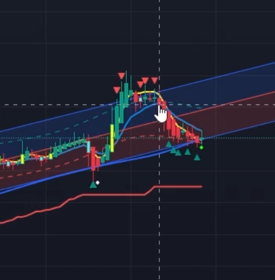

# Yapılacaklar

> Bu dosyaya indikatörler hakkında bilgiler, ekran görüntüleri ve notlar eklenecek.
> Tamamlandığında "hazır" denilecek ve bu bilgilere göre proje güncellenecek.

---

<!-- Aşağıya notlarınızı ekleyebilirsiniz -->
# Double Ema 9 indikatörü:

vermiş olduğun görselde 5 Dakikalık Mum grafikler sarı çizgi olan Double Ema 9 indikatörü altında açılmaya başlıyor burda 2 mum bekleyip sonraki açılan mum kırmızı ise short işlem girebilimiyim düşünmeye başlıyorum ve işleme girmeye karar verdiğimde çıkış noktası için takibe devam ediyorum eğer açılan mumlar linreg negatif bölgesine geçiyorsa grafik içerisnde yer alan mavi çizgi olan mavilim indikatörü temas edinceye kadar takip edip ilk temas noktasında işlemden çıkıyorum.  

önemli not: Double Ema 9 indikatörü dönüşlerde çizgi altında kalan mumlarada bir yükseliş sonrası düşüş işlemlerini kovalamak için kullanılabilir. ben öyle kullanıyorum.

# Mavilim indikatörü:

